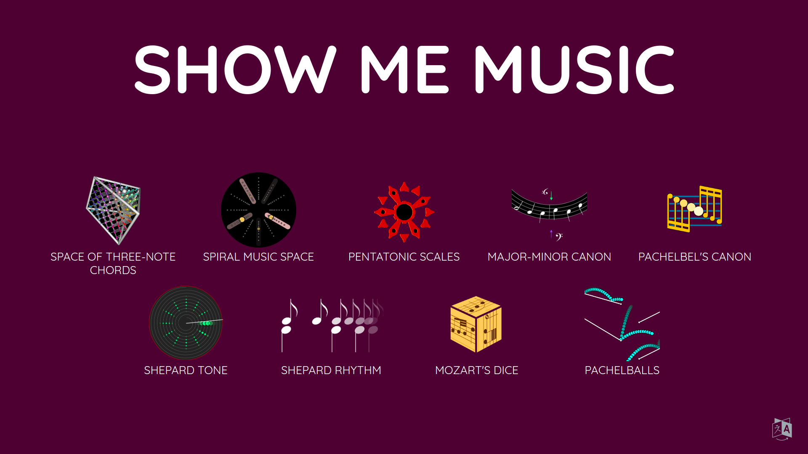
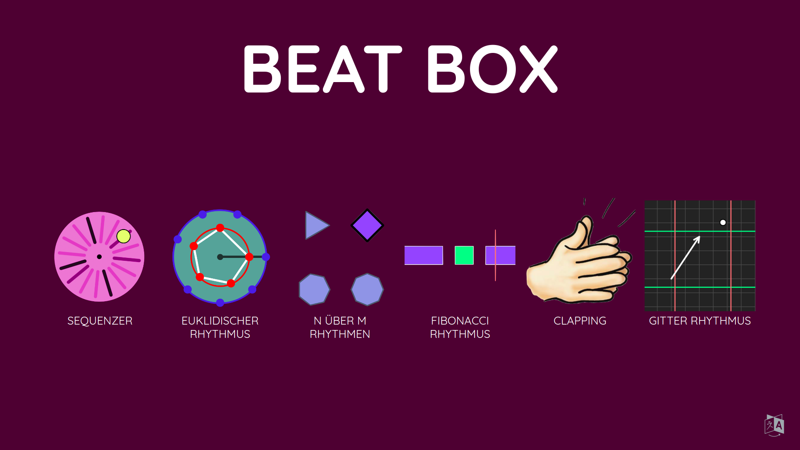

# lalalab-apps

A collection of exhibit-ready [CindyJS](https://cindyjs.org/) applications made for the [Lalalab exhbition](https://lalalab.imaginary.org).
These applets are supposed to be served through the [applauncher2 of IMAGINARY](https://github.com/IMAGINARY/applauncher2).

This repository contains the exhibits of two collections: [ShowMeMusic](http://science-to-touch.com/LaLaLab/ShowMeMusic/) and [BeatBox](http://science-to-touch.com/LaLaLab/BeatBox/).

## Installation (together with applauncher2)

Run `install.sh`, which will download the [applauncher2 of IMAGINARY](https://github.com/IMAGINARY/applauncher2) as submodule and add the corresponding configuration files.

Host everything on a web server. Then the two collections can be opened though `applauncher2/?cfg=showmemusic` and `applauncher2/?cfg=beatbox` respectively.

## Authors & License
All the widgets except `pachelballs` were created by [Jürgen Richter-Gebert](https://geo.ma.tum.de/en/people/juergen-richter-gebert.html). `pachelballs` has been created by [Konrad Heidler](https://github.com/cloud-oak).

The widgets (all folders except `common` and `common-music`) are licensed under the Creative Commons Attribution-NonCommercial-ShareAlike 4.0 International License. To view a copy of this license, visit http://creativecommons.org/licenses/by-nc-sa/4.0/ or send a letter to Creative Commons, PO Box 1866, Mountain View, CA 94042, USA.

The framework CindyJS (`common/js` and `common-music/js`) is licensed under the Apache License 2.0.

The soundfonts (`common/sf` and `common-music/sf`) are made by Benjamin Gleitzman (gleitz@mit.edu) (see [corresponding License](common/sf/LICENSE.txt)).
